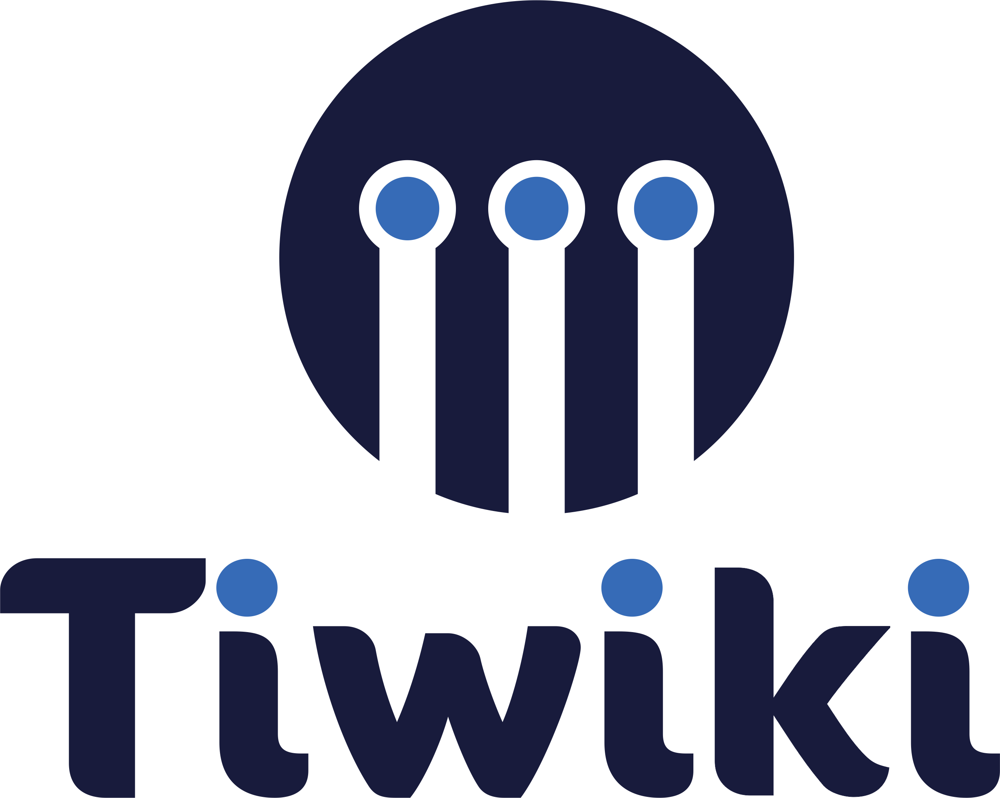

# TiWiki

## Soluções em Tecnologia e Desenvolvimento

  
  
  
  
  
  

## 🌟 Nossa Visão

A TiWiki é uma empresa especializada em soluções tecnológicas inovadoras, comprometida com a excelência e a transformação digital. Nossa expertise em desenvolvimento de software e consultoria em TI nos permite entregar soluções robustas e escaláveis que impulsionam o sucesso dos nossos clientes.

## 💼 Nossas Soluções

- **Desenvolvimento de Software**
  - Sistemas empresariais personalizados
  - Aplicações web e mobile de alta performance
  - Integrações e automações inteligentes
  - Arquiteturas cloud-native

- **Consultoria em TI**
  - Análise e otimização de processos
  - Arquitetura de sistemas
  - Segurança da informação
  - Transformação digital

- **Inovação e Pesquisa**
  - P&D em novas tecnologias
  - Prototipagem rápida
  - Análise de tendências
  - Soluções emergentes

## 🤝 Colaboração e Conhecimento

Este repositório é um espaço dedicado ao compartilhamento de conhecimento e boas práticas em desenvolvimento. Aqui, profissionais de TI podem:

- Explorar exemplos de código e arquiteturas
- Contribuir com soluções inovadoras
- Participar de discussões técnicas
- Acessar recursos e documentações

## 🌐 Conecte-se Conosco

  
  
  
  
  
  

## 📄 Licença

Este projeto está sob a licença [MIT](LICENSE).

---

  Construído com excelência pela TiWiki

  

